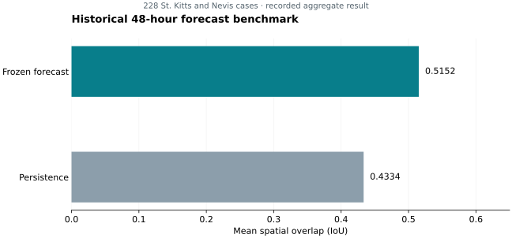

# Sargasso — Research Archive

**Satellite detection, drift forecasting, and coastal-risk research for pelagic sargassum.**

**Josiah Davis · Sargasso**

[Research timeline](TIMELINE.md) · [Experiment index](EXPERIMENTS.md) · [Results](docs/RESULTS.md) · [Methodology](docs/METHODOLOGY.md) · [Cite this work](CITATION.cff)

This archive documents how Sargasso's research evolved: experiments that improved it, approaches that failed, and evaluation corrections that changed what we could responsibly claim. It contains curated research records and aggregate results, not the commercial application or a deployable forecasting service.

## Selected findings

| Research question | Recorded finding | Evidence and interpretation |
| --- | --- | --- |
| Can a frozen 48-hour forecast improve on persistence? | **+18.9% relative mean map IoU**, with **190/228 cases** outperforming persistence | Historical St Kitts and Nevis benchmark; mean IoU **0.5152 vs 0.4334**. Approved investigator-supplied result, not independently reproduced for this release. [Benchmark and limitations](docs/RESULTS.md#historical-48-hour-benchmark) |
| How much can coastal label contamination affect the research problem? | **35.1–40.1%** of positive label pixels in the audited splits were classified as inland by the geometric rule | A label audit, not detector error or independently adjudicated ground truth. [Audit and denominators](docs/RESULTS.md#coastal-label-audit) |
| What did the historical detector selection achieve? | **0.6440 IoU** for the R46/R47 ensemble | Selected-patch, guarded-label, test-tuned historical evaluation; not an unbiased serving estimate. [Detector selection](docs/RESULTS.md#historical-detector-selection) |

These findings use different datasets and protocols. They are not directly comparable and must not be combined into an overall accuracy score.



*Recorded aggregate values. Relative improvement is computed from mean IoU, not a percentage-point accuracy gain. [Underlying table and provenance](docs/RESULTS.md#historical-48-hour-benchmark).*

## Research programme

1. **Detection:** multispectral segmentation, label repair, sampling and loss experiments, ensemble selection, and inference consistency.
2. **Drift:** physics baselines and learned residual corrections, with explicit horizon and coastal applicability limits.
3. **Coastal risk:** a separate physics-derived risk-calibration research track. Existing scores do not establish a validated beaching probability.

The [full documented timeline](TIMELINE.md) starts with the earliest recoverable design record and continues through this release. It retains negative findings, repeated round names, evidence gaps, and later qualifications of earlier results. Dates reflect the underlying record; commit dates are not silently substituted for experiment dates.

## Explore the archive

| Start here | Contents |
| --- | --- |
| [TIMELINE.md](TIMELINE.md) | Chronological experiments, milestones, fixes, and generation changes |
| [EXPERIMENTS.md](EXPERIMENTS.md) | Index of completed, published experiment records |
| [experiments/](experiments/) | Consistent summaries, metadata, evidence, available configurations and aggregate results |
| [Results](docs/RESULTS.md) | Selected figures, denominators, comparisons, and limits |
| [Methodology](docs/METHODOLOGY.md) | Model families, metrics, split discipline, and interpretation |
| [Provenance](docs/PROVENANCE.md) | Source fingerprints, evidence levels, release boundaries, and reproducibility limits |
| [References](docs/REFERENCES.md) | Literature and upstream attribution; machine-readable [BibTeX](references.bib) |
| [Publishing guide](docs/PUBLISHING.md) | Repeatable validation and automatic timeline/index generation |

## Work in progress

**IN PROGRESS:** sub-kilometre coastal forecasting feasibility for St. Kitts: Phase 1 currents-only retrospective hindcasts with real 2018 GLORYS currents, evaluated against frozen Putman rolling GPS cases. **No results from this ongoing benchmark are published.**

There is no active model-training run as of the author's 19 September 2026 status confirmation. See [current status](docs/STATUS.md).

## Reproduce the public archive

The archive publisher uses Python 3.10 or later and the standard library:

```bash
python scripts/publish.py validate
python scripts/publish.py build
python scripts/publish.py check
python -m unittest discover -s tests
```

These commands regenerate the **public archive**, not training or restricted-data benchmarks. Figure reproduction is described in [the results guide](docs/RESULTS.md).

## Citation and reuse

> Davis, Josiah. (2026). *Sargasso: Research Archive*. Sargasso. https://github.com/Jstarzz/Sargasso-Research

Use [CITATION.cff](CITATION.cff) and include the public Git commit when citing a result. Cite upstream methods and data separately.

Original research materials follow the existing **[CC BY 4.0 license](LICENSE)**. Third-party materials retain their own terms. No satellite scenes, restricted datasets, training patches, model weights, product code, credentials, or infrastructure are distributed here. See [licensing and data availability](docs/PROVENANCE.md#licensing-and-data-availability).

For research or sponsorship enquiries, use [Issues](https://github.com/Jstarzz/Sargasso-Research/issues). Authorship reflects substantive research contributions; Josiah Davis is the primary author of this release.
