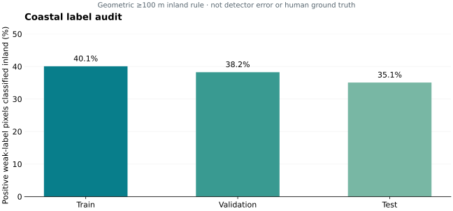

# Results and figures

This page highlights completed findings. The [experiment index](../EXPERIMENTS.md) preserves the wider record, including negative results. Numbers from different label versions, cohorts, and evaluation protocols are not a single leaderboard.

## Historical 48-hour benchmark

The recorded frozen-C nominal 48-hour daily-map benchmark covers **228 admitted historical St. Kitts and Nevis cases from 2024**, using the restricted-source protocol. It is an approved investigator-supplied completed result; this release did not rerun or independently re-audit the protected benchmark.

| Quantity | Recorded value |
| --- | ---: |
| Frozen forecast mean map IoU | 0.5152 |
| Persistence mean map IoU | 0.4334 |
| Paired mean IoU difference | +0.0818 |
| Relative improvement in mean IoU | +18.9% |
| Cases beating / tying / losing to persistence | 190 / 3 / 35 |
| Scorable cases | 228 / 228 |
| 95% confidence interval for paired gain, 14-day block bootstrap | [+0.0655, +0.0977] |

The win fraction is **83.3%**. Relative improvement is `(forecast mean IoU / persistence mean IoU - 1) × 100`. Rounding the reported means reproduces approximately 18.9%; this is not an 18.9 percentage-point accuracy gain.


**Interpretation:** persistence is the reference that retains the observed map. This comparison is not a competitor study, a live operational evaluation, a seven-day forecast test, an isolated learned-model-versus-physics comparison, or a beaching-probability validation. No per-case imagery or restricted outcome arrays are released.

**Evidence:** [public evidence extract and source fingerprint](../evidence/highlight-sources.json), derived from the recorded post-confirmation assessment dated 10 September 2026. [Public numeric table](../results/forecast-benchmark.csv).

## Coastal label audit

The internal segmentation labels were generated from Sentinel-2 imagery with FAI-based weak labeling and cleaning. They are not independent human ground truth. A geometric coastline audit classified positive labels at least 100 m inland for removal; the separate 0–100 m shoreline band was ignored rather than counted as inland removal.

| Split | Audited scenes | Positive pixels before repair | Inland positives removed | Shoreline positives ignored | Inland fraction |
| --- | ---: | ---: | ---: | ---: | ---: |
| Train | 765 / 765 | 1,517,675 | 608,082 | 18,044 | 40.0667% |
| Validation | 171 / 171 | 314,966 | 120,464 | 3,078 | 38.2467% |
| Test | 173 / 173 | 326,093 | 114,367 | 3,304 | 35.0719% |



These are pixel fractions within the audited weak-label dataset, not percentages of ocean area, false detections in live service, or universal label-error prevalence. Scene counts belong to this audit cohort and must not be substituted for other historical training/evaluation cohorts. Coastline geometry and the chosen distance rule affect the classification.

The split-level audit has the coverage shown above. It must not be confused with a separate per-scene figure whose coverage was incomplete. No claim of a completed controlled 2×2 ablation or finished paper is made here.

**Evidence:** [source fingerprint and extracted values](../evidence/highlight-sources.json), based on `papers/paper1-coastal-label-contamination/tables/contamination-by-split.csv`. [Public aggregate table](../results/coastal-label-audit.csv).

## Historical detector selection

The historical R46/R47 mean-probability ensemble, with four-pass test-time augmentation and threshold 0.60, recorded **0.6440 IoU** on the guarded-label, selected-patch evaluation. R48 recorded **0.6287** with TTA at 0.60 and remained a fallback. R49 was completed and discarded; it is not an ongoing training run.

The selected-patch protocol and test-set tuning prevent these scores from establishing unbiased serving performance. **IoU is not pixel accuracy.** Comparisons to earlier rounds must account for label repair, selection, normalization, and evaluation changes. The [timeline](../TIMELINE.md) and [experiment index](../EXPERIMENTS.md) retain those changes.

**Evidence:** the [claim-register fingerprint](../evidence/highlight-sources.json) records the qualification applied to these historical numbers. Experiment bundles retain round-specific evidence.

## Recreate these figures

Install Matplotlib in your own Python environment, then run:

```bash
python -m pip install matplotlib
python scripts/render_figures.py
```

The script reads only the two small public aggregate CSV files in `results/`. It produces SVG figures; it does not access private data or execute models. The confidence interval belongs to the **paired difference**, so it is not drawn as an error bar on either mean.
